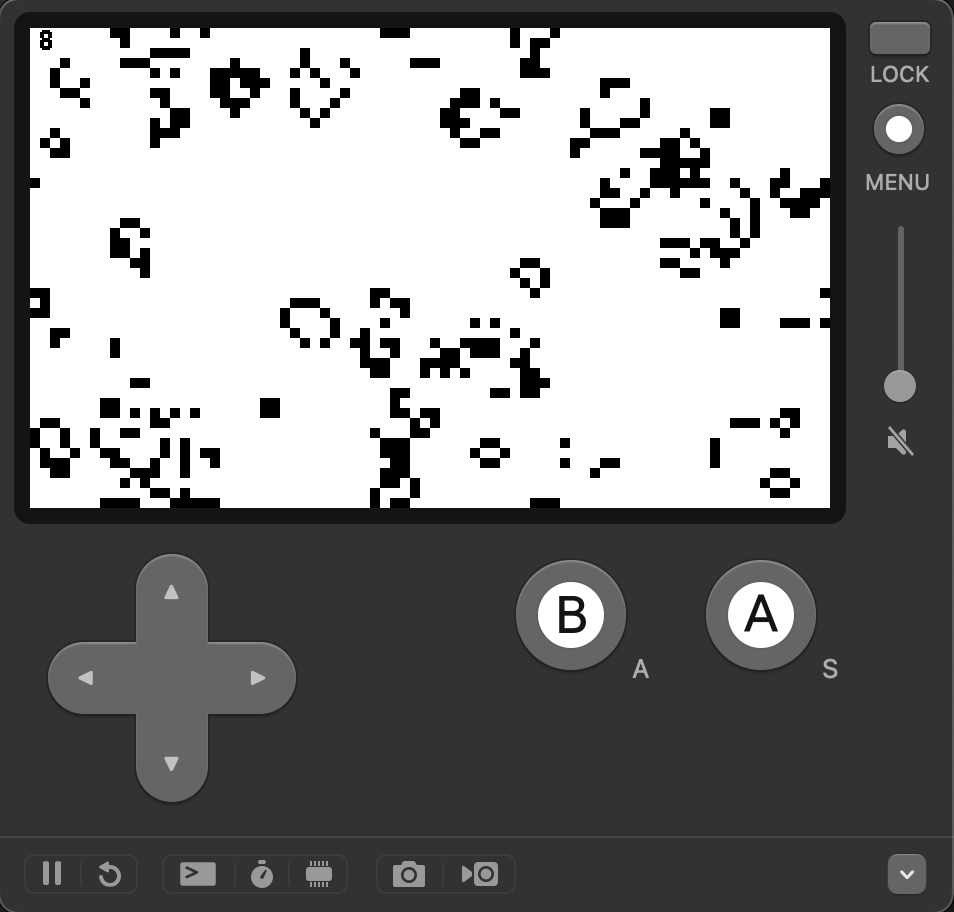

# Game of Life - Playdate C API



### Build & Run

```shell
make clean && make && make run
```

### Controls

<table>
  <tr>
    <td>Up/Down</td><td>Increase/Decrease cell size</td>
  </tr>
  <tr>
    <td>A</td><td>Reset</td>
  </tr>
  <tr>
    <td>B</td><td>Pause</td>
  </tr>
  <tr>
    <td>Crank</td><td>Increase/Decrease probability of a cell being alive on init</td>
  </tr>
</table>
